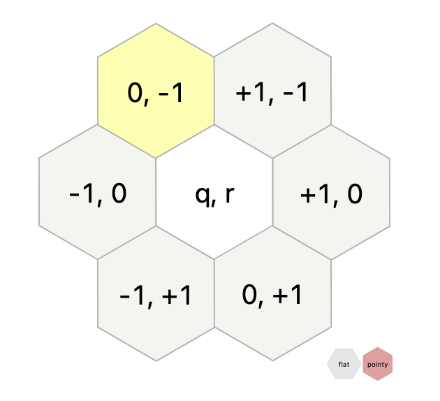
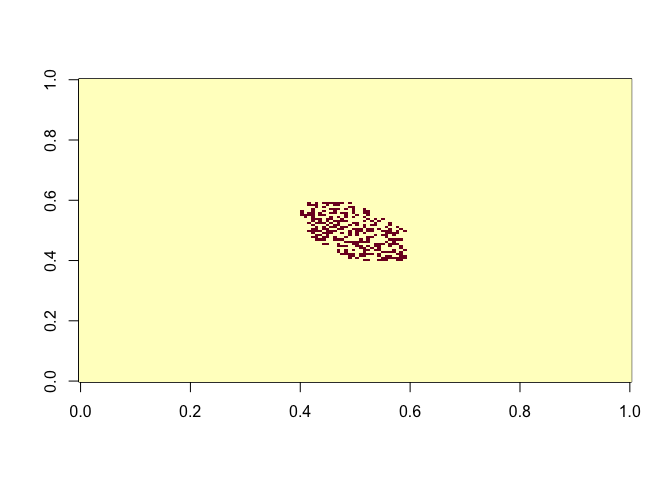
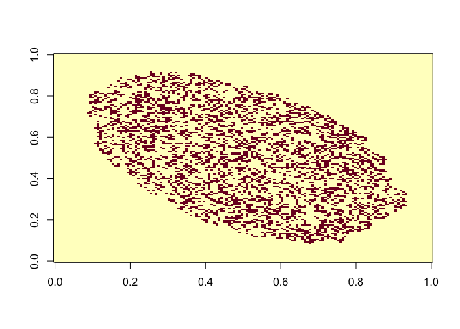

— Day 24: Lobby Layout —
================
Fleur Kelpin
Dec 24, 2020

    library(tidyverse)
    library(Ramble)
    pDirection <- symbol("e") %alt%
      symbol("se") %alt%
      symbol("sw") %alt%
      symbol("w") %alt%
      symbol("nw") %alt%
      symbol("ne")
    pDirections <- many(pDirection)
    input <- read_csv("day24.txt", col_names = "directions") %>%
      rowwise() %>%
      mutate(directions = list(unlist(pDirections(directions)$result)))

# Part 1

> A member of the renovation crew gives you a list of the tiles that
> need to be flipped over (your puzzle input). Each line in the list
> identifies a single tile that needs to be flipped by giving a series
> of steps starting from a reference tile in the very center of the
> room. (Every line starts from the same reference tile.) Go through the
> renovation crew’s list and determine which tiles they need to flip.
> After all of the instructions have been followed, how many tiles are
> left with the black side up?

Let’s use [Axial
Coordinates](https://www.redblobgames.com/grids/hexagons/), then we can
sum the coordinate differences.

    diffs <- function(direction) {
      switch(direction,
        "e"= c(1L, 0L),
        "se"= c(0L, 1L),
        "sw"= c(-1L, 1L),
        "w"= c(-1L, 0L),
        "nw"= c(0L, -1L),
        "ne"= c(1L, -1L)
      )
    }
    input <- input %>%
      rowwise() %>%
      mutate(tile = list(reduce(
        unlist(directions), 
        function(coord, direction) { coord + diffs(direction) },
        .init=c(0,0)))) %>%
      mutate(q = tile[[1]]) %>%
      mutate(r = tile[[2]]) %>%
      select(q, r)

    black_tiles <- input %>%
      group_by(q,r) %>%
      tally() %>%
      rowwise() %>%
      mutate(color = if (n %% 2 == 1) "black" else "white") %>% 
      filter(color == "black")
    black_tiles %>%
      nrow()

    ## [1] 269

# Part 2

> The tile floor in the lobby is meant to be a living art exhibit. Every
> day, the tiles are all flipped according to the following rules:

> -   Any black tile with zero or more than 2 black tiles immediately
>     adjacent to it is flipped to white.
> -   Any white tile with exactly 2 black tiles immediately adjacent to
>     it is flipped to black.

> Here, tiles immediately adjacent means the six tiles directly touching
> the tile in question.

Even more game of life. Yay!

    floor <- matrix(data = FALSE, nrow = 150, ncol=150)
    for(i in 1:nrow(black_tiles)) {
      floor[black_tiles$q[[i]] + 75,
            black_tiles$r[[i]] + 75] <- TRUE  
    }
    image(floor)

<!-- -->

    life_step <- function(d) {
      nrow <- dim(d)[[1]]
      ncol <- dim(d)[[2]]
      d_e <- rbind(d[-1, , drop = FALSE], 0)        #[q+1, r  ] e
      d_w <- rbind(0, d[-nrow, , drop = FALSE])     #[q-1, r  ] w
      d_se <- cbind(d[, -1, drop = FALSE], 0)       #[q  , r+1] se
      d_nw <- cbind(0, d[, -ncol, drop = FALSE])    #[q  , r-1] nw
      d_ne <- cbind(0, d_e[, -ncol, drop = FALSE])  #[q+1, r-1] ne
      d_sw <- cbind(d_w[, -1, drop = FALSE], 0)     #[q-1, r+1] sw
      pop <- d_e + d_w + d_se + d_nw + d_ne + d_sw
      (!d & pop == 2) | (d & between(pop,1,2))
    }

    for(i in 1:100) {
      floor <- life_step(floor)
    }
    image(floor)

<!-- -->

    sum(floor)

    ## [1] 3667
